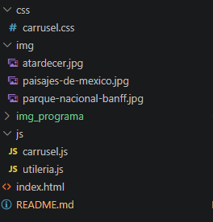
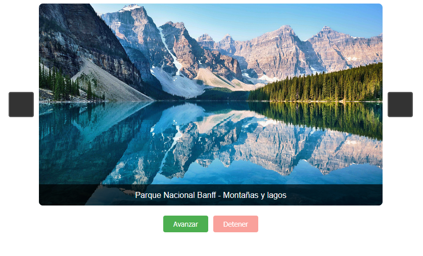
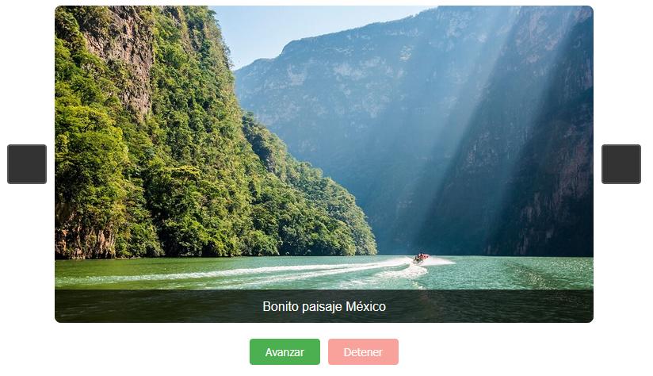
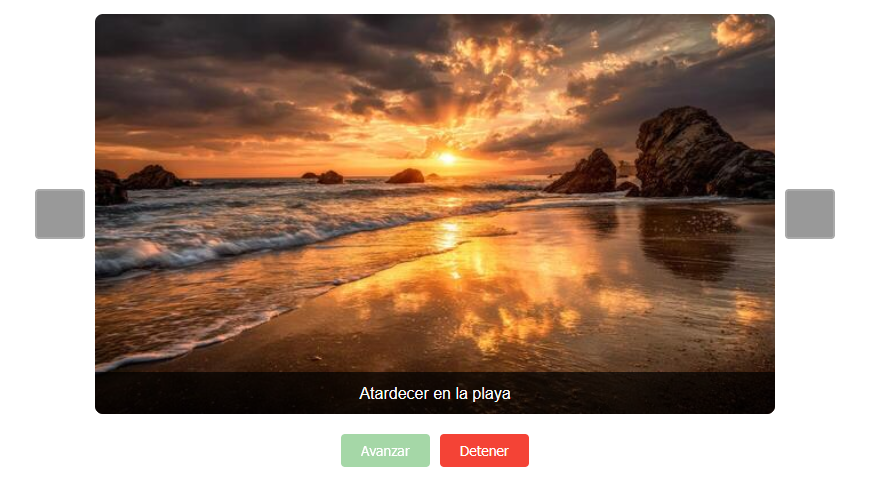

# Componente-Visual
Intrituto tecnologico de oaxaca


Alumno: santiago ramirez erick omar 
Profesora: Programacion Web
Materia:  Martinez Nieto Adelina

creacion de una libreria para un componente visual en js


### ¿Qué problema resuelve?
El renderizado y control de galerías de imágenes dinámicas suele mezclar la lógica de la secuencia de índices con los eventos del navegador. Este proyecto soluciona ese acoplamiento dividiendo el cálculo matemático de las posiciones (módulos reutilizables) de la lógica de renderizado e intervalos de tiempo, garantizando un código escalable, libre de dependencias y de alta velocidad de respuesta.

---



el componente visual hecho con el archivo js sirve para crear un carrusel de imagenes donde almacena las imagenes en un arreglo , asi como implementa las funcionalidades para avanzar de imagen usando el metodo pasarFoto() para que avaza a la siguinete posicion del arrglo de las imagenes y el metodo retrocederFoto(), este metodo lo implementamos con unos botones en la interfaz




 tambien cuenta con la funcion playIntervalo() que se coloca en un boton para que al presionarlo avance automaticamnete las imagen es tambien usamos un intervalo de timepo en la transicion de las imagnes, pero a mismo tiempo este boton desavilita la funcion de los botones para avanzar


el metodo de stopIntervalo() devitene el evento playIntervalo() para poder vanzar las imagenes nuevamnete 1 por 1


Estructura e Instalación

La arquitectura del proyecto está distribuida en capas independientes. Para integrarlo en tu servidor local o entorno web, incluye los archivos en tu documento HTML respetando el orden de dependencia de los scripts:

```html
<!-- Estilos visuales del contenedor y transiciones -->
<link rel="stylesheet" href="css/carrusel.css">

<!-- Capa 1: Funciones lógicas independientes (Utilería) -->
<script src="js/utileria.js"></script>

<!-- Capa 2: Controlador de eventos e interfaz (Core) -->
<script src="js/carrusel.js"></script>

Instalación y Configuración

Para integrar las validaciones en tu proyecto, puedes copiar el archvo utileriajs que se encuentra en la carpeta js y hacer referencia del archivo en el pie de tu documento HTML antes del cierre de la etiqueta `</body>`:
```


en este proyecto tambien se gregan las imagenes que se usan en el carrusel en la carpeta img
el estilo css aplicado en lac carpeta css  archivo carrusel.css

y la estructura de la pagina en el index.html


funciones principales 
Estas funciones se encargan de calcular de forma matemática hacia qué índice debe moverse el carrusel, controlando los límites del arreglo de forma circular sin interactuar con elementos HTML.
```
/** Calcula la siguiente posición del carrusel. Si llega al final del array, reinicia a 0.*/
function calcularSiguientePosicion(posicionActual, totalImagenes) {
    return (posicionActual >= totalImagenes - 1) ? 0 : posicionActual + 1;
}

/*Calcula la posición anterior del carrusel. Si está en el índice 0, salta al último elemento.*/
function calcularAnteriorPosicion(posicionActual, totalImagenes) {
    return (posicionActual <= 0) ? totalImagenes - 1 : posicionActual - 1;
}```

Gestión de Estado y Autoplay (js/carrusel.js)

```
// Consumo de las funciones de utilería dentro del controlador
function pasarFoto() {
    posicionActual = calcularSiguientePosicion(posicionActual, IMAGENES.length);
    renderizarImagen();
}

function playIntervalo() {
    intervalo = setInterval(pasarFoto, TIEMPO_INTERVALO);
    
    // Bloqueo de controles para evitar desajustes en el autoplay
    $botonAvanzar.disabled = true;
    $botonRetroceder.disabled = true;
    $botonPlay.disabled = true;
    $stopButton.disabled = false;
}```